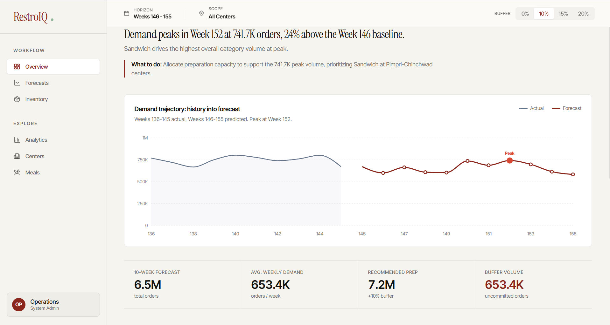
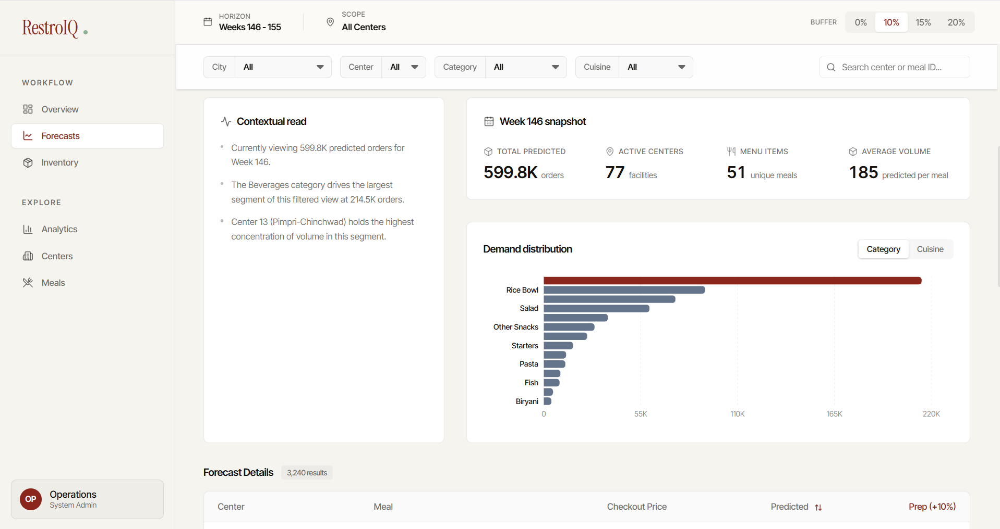
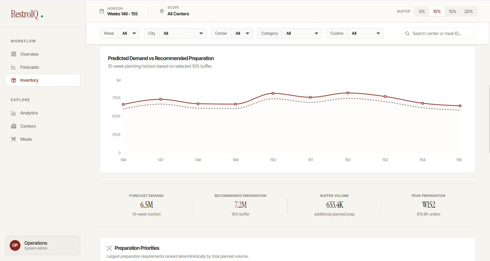
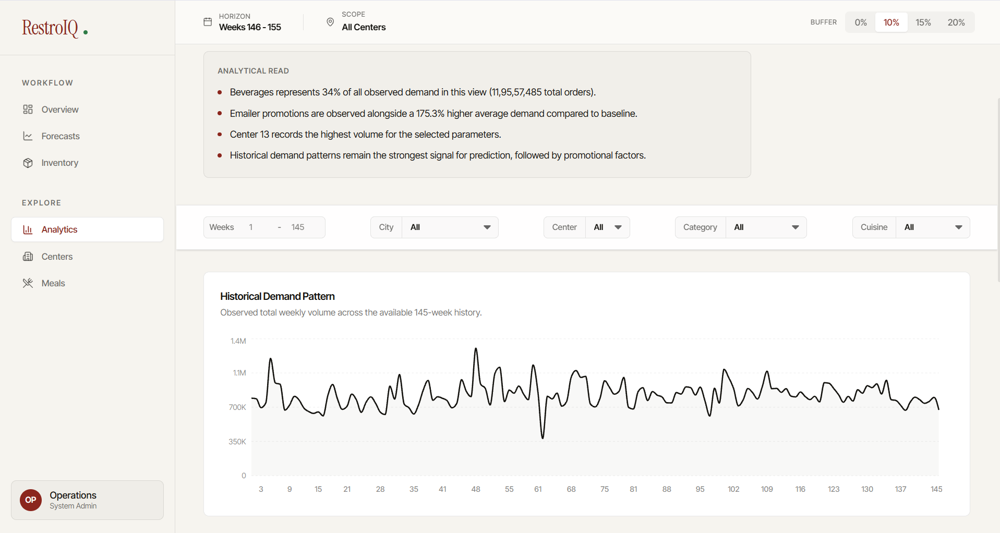
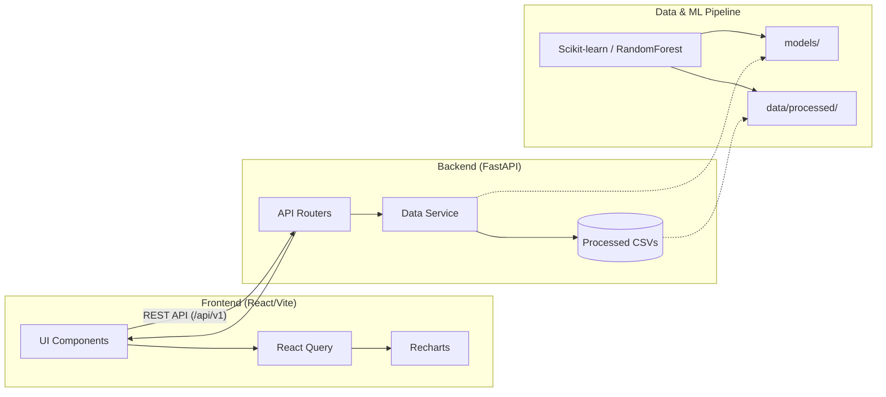

<div align="center">
  <h1>🍽️ RestroIQ</h1>
  <p><strong>Restaurant Operations Intelligence Platform</strong></p>

  <p>
    
    
    
    
  </p>
  <p>
    
    
    
    
  </p>
</div>

---

## 📖 About The Project

RestroIQ is an end-to-end intelligence platform built to explore food-demand forecasting, preparation planning, and operational analytics through an interactive dashboard. 

The primary objective of RestroIQ is to translate historical demand data into actionable future estimates. By combining modern machine learning techniques with a premium, analytical user interface, it provides detailed forecast trajectories, configurable preparation scenarios, and deep multi-dimensional analytics.


---


## 📸 Dashboard Previews

<div align="center">
  
  <br/><i>Overview: High-level demand forecasts and operational summaries</i><br/><br/>
  
  
  <br/><i>Forecasts: Future demand projections with extensive filtering</i><br/><br/>
  
  
  <br/><i>Inventory: Configurable preparation-buffer scenarios</i><br/><br/>
  
  
  <br/><i>Analytics: Historical trends and feature importance distributions</i>
</div>


## ✨ Core Modules & Features

- **📊 Overview**  
  High-level demand forecasts and operational summaries displaying predicted orders, peak weeks, and top-performing segments.

- **🔮 Forecasts**  
  Explore future demand projections across fulfillment centers, meal categories, and cuisines. Features extensive filtering, searching, and sorting capabilities.

- **📦 Inventory & Preparation Planning**  
  Configurable preparation-buffer scenarios (0%, 10%, 15%, 20%) to visualize planning allowances based on predicted demand.  
  *Note: This module focuses strictly on forward-looking preparation planning; it is not a live inventory-balance tracking system.*

- **📈 Analytics**  
  Deep dive into historical demand trends, order distributions, and promotion-associated comparisons. Includes model feature importance visualizations.

- **🏬 Centers**  
  Center-level exploration allowing users to isolate demand predictions and historical performance by city, region, and center type.

- **🍽️ Meals**  
  Granular analysis at the meal level, grouping data by category and cuisine, equipped with an interactive 10-week forecast explorer.

---

## 🏗️ Architecture

RestroIQ utilizes a clear separation of concerns, connecting a reactive Vite/React frontend to a fast, Python-based API that serves processed analytical data and model outputs.



### Directory Structure Highlights
- `frontend/`: The Vite/React application encompassing all UI components and pages.
- `backend/`: The FastAPI server containing core business logic and API endpoints.
- `data/raw/`: Original unmanipulated source datasets.
- `data/processed/`: Processed datasets and forecast outputs consumed directly by the backend.
- `data/external/`: Supplementary mapping and metadata files.
- `models/`: Saved ML artifacts (e.g., `best_model.pkl`, encoders, and metadata).
- `ml_pipeline/`: Python scripts responsible for feature engineering, model training, and batch inference.

---

## ⚠️ Dataset & Methodology Transparency

The project utilizes the [Kaggle Food Demand Forecasting dataset](https://www.kaggle.com/datasets/kannanaikkal/food-demand-forecasting). 

**Important Context & Limitations:**
- **Source Nature:** The dataset models historical food demand at fulfillment centers. It is *not* representing real-time restaurant POS transaction data.
- **Simulations:** The geographic mapping of anonymized center codes to cities, the assignment of specific calendar dates, holiday generation, and weather associations are **simulation choices** designed to provide analytical depth, not verified historical ground truths.
- **Estimates:** Model predictions are statistical estimates of future demand, not guaranteed outcomes.
- **Preparation Buffers:** The configurable 10%, 15%, and 20% buffers represent strategic planning allowances to prevent stockouts, *not* measured food waste.
- **Analytics:** Feature importance charts visualize the ML model's internal decision weights, which is observational and does not prove real-world causality.

---

## 🚀 Installation & Local Setup

### Prerequisites
- **Git** & **Git LFS** (Required to clone large datasets and `.pkl` artifacts).
- **Python 3.9+**
- **Node.js 18+** & **npm**

### 1. Clone the Repository
Because the project tracks large datasets via Git Large File Storage (LFS), ensure LFS is installed before cloning.
```bash
git lfs install
git clone https://github.com/parikshit-singh05/RestroIQ.git
cd RestroIQ
```

### 2. Backend Setup
The backend serves data directly from the processed CSVs.
```bash
cd backend
python -m venv venv

# Activate the virtual environment:
# Windows:
.\venv\Scripts\activate
# macOS/Linux:
source venv/bin/activate

pip install -r requirements.txt

# Start the FastAPI server on port 8000
uvicorn app.main:app --reload --host 127.0.0.1 --port 8000
```
*API Interactive Docs (Swagger): [http://127.0.0.1:8000/docs](http://127.0.0.1:8000/docs)*

### 3. Frontend Setup
Open a new terminal session, navigate to the frontend directory, and start the Vite dev server.
```bash
cd frontend
npm install

# Start the development server
npm run dev
```
*The UI will be accessible at [http://localhost:5173](http://localhost:5173).*

### Production Build
To create an optimized production build for the frontend:
```bash
cd frontend
npm run build
npm run preview
```

---

## 🔌 API Documentation

The backend exposes several read-only endpoints prefixed with `/api/v1` that power the dashboard:

| Endpoint | Description |
|---|---|
| `GET /summary` | Returns high-level forecast summaries including total orders and week-over-week trends. |
| `GET /inventory` | Fetches aggregated item-level preparation requirements with buffer scenarios. |
| `GET /forecasts/detailed` | Returns paginated row-level forecast data. Supports parameters like `limit`, `skip`, and sorting. |
| `GET /centers` | Provides a directory of all active fulfillment centers with location and type metadata. |
| `GET /meals` | Provides the complete menu of trackable meals, broken down by cuisine and category. |
| `GET /analytics` | Returns historical demand distributions, promotional impact, and feature importance data. |
| `GET /centers/analysis` | Delivers detailed demand performance and forecast trajectory grouped by individual centers. |
| `GET /meals/analysis` | Delivers 10-week forecast trajectories specific to individual meals. |

---

## 👥 Contributors

- **Parikshit Singh** — [GitHub Profile](https://github.com/parikshit-singh05)
- **Rasraj Suri** — [GitHub Profile](https://github.com/Rasraj177)

---
<div align="center">
  <i>Developed as a final-year academic project.</i>
</div>
